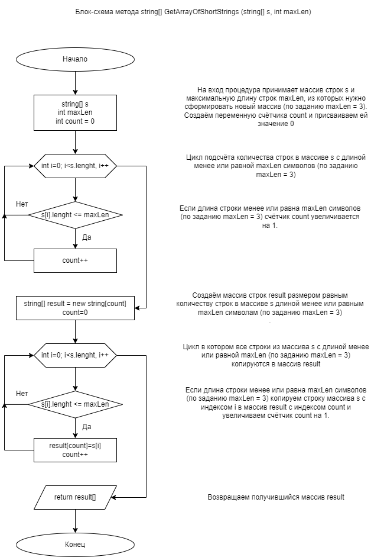
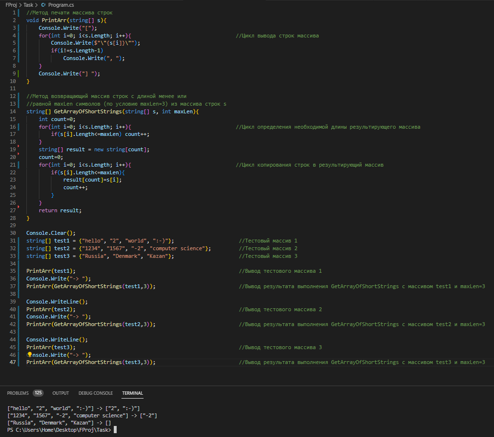

# Итоговая проверочная работа

## *Задание*
---

* Создать репозиторий на GitHub
* Нарисовать блок-схему алгоритма (можно обойтись блок-схемой основной содержательной части, если вы выделяете её в отдельный метод)
* Снабдить репозиторий оформленным текстовым описанием решения (файл README.md)
* Написать программу, решающую поставленную задачу
* Использовать контроль версий в работе над проектом

## *Решение*
---
В ходе выполнения итоговой проверочной работы были выполнены следующие шаги:
* Создан новый репозиторий на GitHub.
* При помощи сервиса [draw.io](https://app.diagrams.net/) сформирована блок-схема основного алгоритма программы, представленная на изображении ниже

* Создан файл-описание README.md в формате Markdown.
* На языке C# написана и протестирована программа, реализующая заданную задачу. 
* При выполнении заданий применялась система контроля версий Git с последовательным созданием серии коммитов и их загрузкой в мой репозиторий на [GitHub.com](https://GitHub.com), доступный по [ссылке](https://github.com/Alisbur/FProj.git).

## *Алгоритм работы программы*
---
В программе реализованы методы:
* __PrintArray__ - вывод массива строк на экран, принимающий в качестве входного аргумента массив строк. Алгоритм работы метода:
    * С помощью цикла и метода Console.Write в консоль последовательно выводятся все строки массива-аргумента. Также выводятся дополнительные символы для корректного форматирования вывода результата в соответствии с заданием.
* __GetArrayOfShortLines__ - метод, принимающий в качестве входных аргументов массив строк и минимальную длину строк (по заданию 3 символа) и возвращающий новый массив строк, сформированный из строк первоначального массива с длиной менее или равной минимальной длине (по заданию 3 символа). Алгоритм работы метода:
    * С помощью цикла и счётчика определяется количество строк в исходном массиве с длиной менее или равной минимальной длине (по заданию 3 символа).
    * Инициализируется новый массив строк с длиной, определённой на предыдущем этапе.
    * С помощью цикла в новый массив копируются все строки из исходного массива с длиной менее или равной минимальной длине (по заданию 3 символа).
    * В результате выполнения метод возвращает новый массив строк.

Порядок выполнения программы:
1. Инициализируются тестовые массивы test1, test2, test3 состоящие из строк различной длины в соответствии с примерами из задания. 
2. Для отображения каждого исходного массива вызывается метод PrintArray с очередным тестовым массивом в качестве аргумента.
3. Для отображения результата выполнения программы вызывается метод PrintArray в качестве аргумента которого выступает результат выполнения метода GetArrayOfShortLines с очередным тестовым массивом в качестве аргумента.
4. Шаги 2 и 3 повторяются для всех тестовых массивов.

## *Пример выполнения программы*
---

На изображении ниже представлен снимок экрана при выполнения программы:

# Спасибо за внимание!